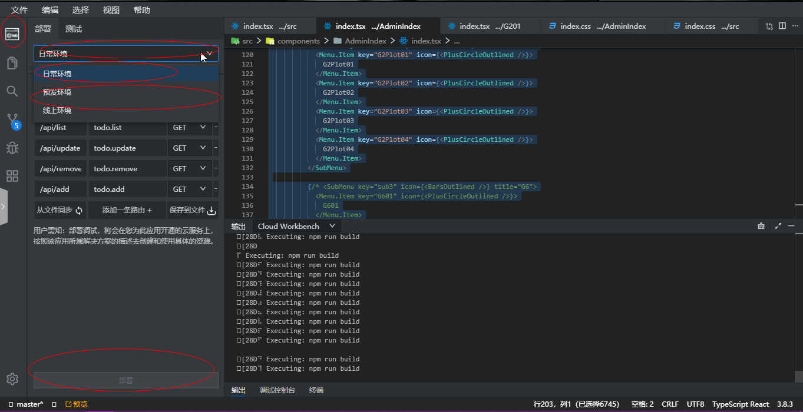
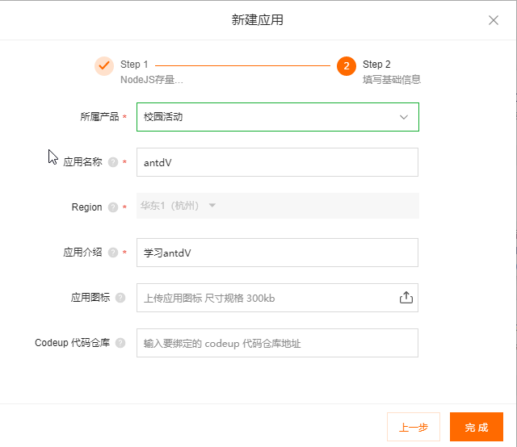
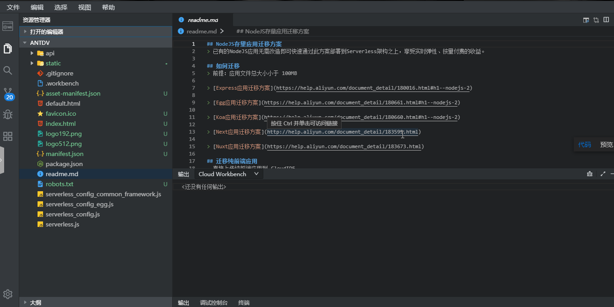

# 利用云开发平台画图表


最近爱上了一个画图表的框架，antV，所以就想着利用阿里云云开发平台来学习一波这个好用的图表工具，在这里可以画出各种各样的美丽图标，在配合云开发平台十分方便的部署，学习起来真是太爽了

那么这就有两种开发方式：一种是在本地开发，开发完后打包项目，利用云开发平台的nodejs存量迁移进行部署；第二种是直接在云开发平台进行开发，所有写代码环节都在webIDE中进行，这篇文章主要对两种方式进行讲解

所用技术：云开发平台，react，antdV

## 开发前准备

首先要有一个阿里云账号，然后还需要开通阿里云开发平台，接着跟着我来一步一步来进行云上开发！


首先要创建一个项目，实验室 -> WEB -> Midway Serveless OTS ,(这里并没有用到OTS哦，只是用到了这个·方案生成的react模板)


然后给应用起个名字并添加一段介绍


点击上一步完成后会有一小段时间的项目初始化过程，然后会出现下图的开发部署四个字，点击开发部署


点击过后会打开webIDE，可能会慢一些，耐心等待


如果长时间加载不出来，尝试一下方案

打开如下应用管理界面:https://ide.aliyun.com/，将刚刚创建的应用先暂停掉，然后该应用会进行冻结状态，接着删除该应用，在返回到开发部署重新打开webIDE


加载成功后就可以看到如下界面，到这一步就开始正式的开发了！


## 将项目跑起来

开发前首先要进行的就是安装依赖，照着README.md里的方法进行用npm+淘宝镜像安装


安装完成后，运行 `npm run dev`, 终端会给出一个临时地址，访问这个地址就可以看到这个项目默认的样子了


## 进行开发

我们不需要它自带的那个模板，我们将它自带的删掉，书写自己的代码

整个项目的依赖都有：

```
"@ant-design/charts": "^1.0.4",
"@antv/g2": "^4.0.15",
"@antv/g6": "^3.8.3",
"@antv/graphin": "^1.5.0",
"@antv/l7": "^2.2.41",
"@antv/l7-maps": "^2.2.41",
"antd": "^4.8.0",
"bizcharts": "^4.0.14",
"react-router-dom": "^5.2.0",
```

需要先将这些一来进行安装，安装方式和上面安装方式一样使用npm + 淘宝镜像的方式安装

然后书写我们的项目入口文件 index.tsx:

```tsx
import React, { useEffect, useState } from 'react'
import ReactDOM from 'react-dom';
import './index.css';
import { HashRouter  as Router, Route } from "react-router-dom";

import AdminIndex from './components/AdminIndex/index'

export default function App() {

  return (
    <Router>
      <div>
        <Route path="/" component={AdminIndex} />
      </div>


    </Router>
  )
}

ReactDOM.render(
  <React.StrictMode>
    <App />
  </React.StrictMode>,
  document.getElementById('root')
);
```


在 index.css 引入antd的样式：

```
@import '~antd/dist/antd.css';
```

然后书写我们布局组件 AdminIndex ：

```tsx
import React, { useState } from 'react';
import { Route } from "react-router-dom";

import './index.css'
import { Layout, Menu, Breadcrumb } from 'antd';

import {
  BarsOutlined,
  PlusCircleOutlined,
  BarChartOutlined,
  FormOutlined
} from '@ant-design/icons';

import G201 from '../G201/index'
import G202 from '../G202/index'

import G2Plot01 from '../G2Plot01/index'
import G2Plot02 from '../G2Plot02/index'
import G2Plot03 from '../G2Plot03/index'
import G2Plot04 from '../G2Plot04/index'

import G601 from '../G601/index'
import G602 from '../G602/index'

import Graphin01 from '../Graphin01/index'
import Graphin02 from '../Graphin02/index'
import Graphin03 from '../Graphin03/index'

// import L701 from '../L701/index'
import L702 from '../L702/index'

const { Header, Content, Footer, Sider } = Layout;
const { SubMenu } = Menu;

function AdminIndex(props) {

  const [collapsed, setCollapsed] = useState(false)
  const [url, setUrl] = useState('无')

  const onCollapse = () => {
    setCollapsed(!collapsed)
  }

  const handleClickArticle = e => {
    setUrl(e.key)

    switch (e.key) {
      case "G201":
        setUrl('G201')
        props.history.push('/G201')
        break
      case "G202":
        setUrl('G202')
        props.history.push('/G202')
        break
      case "G2Plot01":
        setUrl('G2Plot01')
        props.history.push('/G2Plot01')
        break
      case "G2Plot02":
        setUrl('G2Plot02')
        props.history.push('/G2Plot02')
        break
      case "G2Plot03":
        setUrl('G2Plot03')
        props.history.push('/G2Plot03')
        break
      case "G2Plot04":
        setUrl('G2Plot04')
        props.history.push('/G2Plot04')
        break
      case "G601":
        setUrl('G601')
        props.history.push('/G601')
        break
      case "G602":
        setUrl('G602')
        props.history.push('/G602')
        break
      case "Graphin01":
        setUrl('Graphin01')
        props.history.push('/Graphin01')
        break
      case "Graphin02":
        setUrl('Graphin02')
        props.history.push('/Graphin02')
        break
      case "Graphin03":
        setUrl('Graphin02')
        props.history.push('/Graphin03')
        break
      case "L701":
        setUrl('L701')
        props.history.push('/L701')
        break
      case "L702":
        setUrl('L702')
        props.history.push('/L702')
        break
    }


  }

  return (
    <Layout style={{ minHeight: '100vh' }} >
      <Sider collapsible collapsed={collapsed} onCollapse={onCollapse} style={{ position: "fixed", height: "100%" }}>
        <div className="logo" style={{ height: 32, backgroundColor: '#ffffff33', color: '#fff', margin: 16, textAlign: 'center', lineHeight: 2.2 }}>欢迎</div>
        <Menu theme="dark" defaultSelectedKeys={['Manager']} mode="inline" onClick={handleClickArticle}>
          <SubMenu key="sub1" icon={<BarsOutlined />} title="G2">
            <Menu.Item key="G201" icon={<PlusCircleOutlined />}>
              G201
            </Menu.Item>
            <Menu.Item key="G202" icon={<PlusCircleOutlined />}>
              G201
            </Menu.Item>
          </SubMenu>

          <SubMenu key="sub2" icon={<BarsOutlined />} title="G2Plot">
            <Menu.Item key="G2Plot01" icon={<PlusCircleOutlined />}>
              G2Plot01
            </Menu.Item>
            <Menu.Item key="G2Plot02" icon={<PlusCircleOutlined />}>
              G2Plot02
            </Menu.Item>
            <Menu.Item key="G2Plot03" icon={<PlusCircleOutlined />}>
              G2Plot03
            </Menu.Item>
            <Menu.Item key="G2Plot04" icon={<PlusCircleOutlined />}>
              G2Plot04
            </Menu.Item>
          </SubMenu>

          <SubMenu key="sub4" icon={<BarsOutlined />} title="Graphin">
            <Menu.Item key="Graphin01" icon={<PlusCircleOutlined />}>
              Graphin01
            </Menu.Item>
            <Menu.Item key="Graphin02" icon={<PlusCircleOutlined />}>
              Graphin02
            </Menu.Item>
            <Menu.Item key="Graphin03" icon={<PlusCircleOutlined />}>
              Graphin03
            </Menu.Item>
          </SubMenu>

        </Menu>
      </Sider>
      <Layout className="site-layout" style={{ marginLeft: 200 }}>
        <Header className="site-layout-background" style={{ padding: 0 }} >
          <div style={{ fontSize: 28, paddingLeft: 20, fontWeight: 'bold' }}>antdV</div>
        </Header>
        <Content style={{ margin: '0 16px' }}>
          <Breadcrumb style={{ margin: '16px 0' }}>
            <Breadcrumb.Item>{url}</Breadcrumb.Item>
          </Breadcrumb>
          <div className="site-layout-background" style={{ padding: 24, minHeight: 360 }}>
            <div style={{ padding: 24, background: '#fff', minHeight: 450 }}>

              <div>
                <Route path="/G201" exact component={G201} />
                <Route path="/G202" exact component={G202} />
                <Route path="/G2Plot01" exact component={G2Plot01} />
                <Route path="/G2Plot02" exact component={G2Plot02} />
                <Route path="/G2Plot03" exact component={G2Plot03} />
                <Route path="/G2Plot04" exact component={G2Plot04} />
                <Route path="/G601" exact component={G601} />
                <Route path="/G602" exact component={G602} />
                <Route path="/Graphin01" exact component={Graphin01} />
                <Route path="/Graphin02" exact component={Graphin02} />
                <Route path="/Graphin03" exact component={Graphin03} />
                {/* <Route path="/L701" exact component={L701} /> */}
                <Route path="/L702" exact component={L702} />
              </div>

            </div>
          </div>
        </Content>
        <Footer style={{ textAlign: 'center' }}>跌倒的小黄瓜 ©2020 Created by Aliyun Midway</Footer>
      </Layout>
    </Layout>
  )
}

export default AdminIndex

```

可以看到这里就是展现一个又一个组件，[具体到每个组件我就放到github上了](),来看一下最终的效果吧


更多细节可以访问利用云开发部署的地址：[项目展示地址]()

到这里代码就写完了，下面就是将它上线了

## 利用云开发平台部署上线

先将写好的代码都提交到云开发平台分配的仓库，防止代码丢失然后按照下图进行日常环境部署和预发环境部署



部署完成后，到应用列表找到该用用的 CNAME地址

将该cname解析到一个自己已备案的域名上，使用CNAME解析，解析记录为上面的 CNAME 地址

然后返回应用列表，将域名补充到应用信息上，进入webIDE进行线上部署

部署成功后就可通过你自己的域名访问了


## 另一种方式，使用nodejs存量迁移

下面是另一种部署方式




在本地使用脚手架自己创建react项目，然后将上面在webIDE中的代码进行拷贝，然后运行起来发现没有错误，就可以打包，打包结果文件世纪将要部署的文件

打开webIDE看到如下界面：


直接将上面打包好的文件拖到根目录：



然后按照第一种相同的方式进行日常环境部署和预发环境部署，解析域名，线上部署，最后上线


[最后这是第二种方式的部署结果](http://serveless_antdv-learn.ygjie.icu/#/)